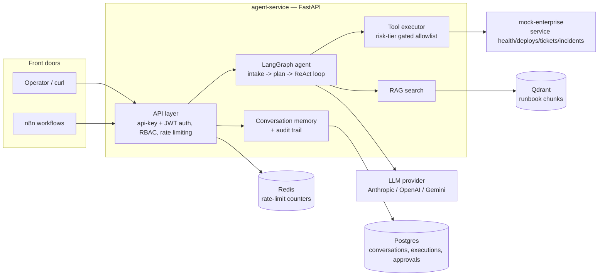
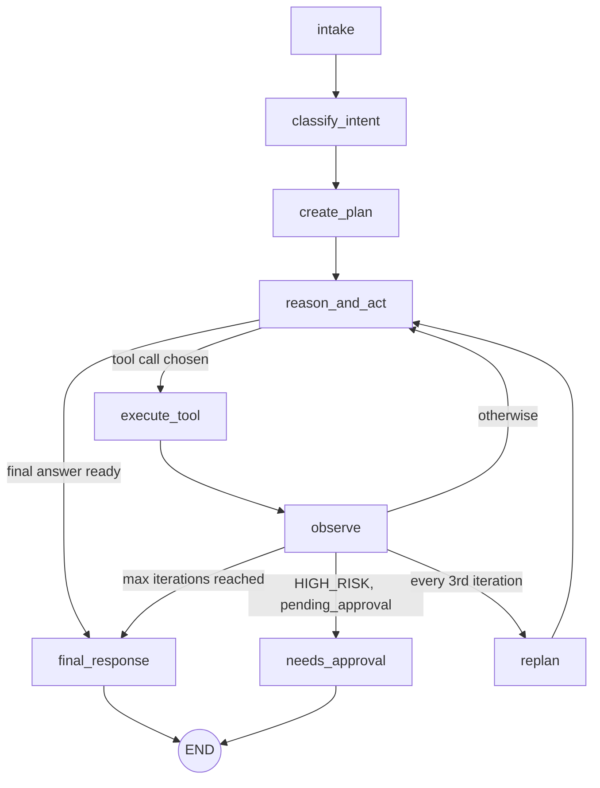

# Architecture

## System overview

Everything the agent knows about the outside world comes through exactly
two doors: **RAG search** (read-only, Qdrant) for institutional knowledge
(runbooks), and the **tool executor** (allowlisted, risk-tier gated) for
live system state and actions (mock-enterprise). The LLM never touches
either directly — it only ever sees text (the tool catalog, retrieved
chunks, prior observations) and returns text (its next thought/action/
answer as JSON), which `app/agent/prompts.py::parse_agent_json` parses.
See `decisions.md` for why this is a plain `complete()` interface rather
than a vendor tool-calling schema.

## The agent loop

Bounded two ways at once (`app/agent/graph.py`): a hard iteration count
(`AGENT_MAX_ITERATIONS`) and a wall-clock timeout (`AGENT_TIMEOUT_S`),
plus an explicit LangGraph `recursion_limit` set well above what
`max_iterations` alone would suggest — one logical iteration spans
several graph node executions, and the default `recursion_limit` (25)
tripped before `max_iterations` did until this was fixed (see
`decisions.md` and `tests/test_agent.py`'s regression test for that).
Every reasoning artifact (plan, thought, chosen tool + arguments, tool
result, conclusion) is stored as structured `AgentState` fields, not
hidden chain-of-thought — the whole point of an audit trail is being
able to see why the agent did what it did.

## Risk tiers

| Tier | Auto-executes? | Examples |
|---|---|---|
| `READ_ONLY` | Yes | `get_service_health`, `get_service_logs`, `search_knowledge` |
| `LOW_RISK` | Yes, policy-gated | `create_ticket`, `update_ticket`, `create_incident` |
| `HIGH_RISK` | No — pauses for human approval | `rollback_deployment` |
| `CRITICAL` | Never, even with approval | `delete_resource` |

An unknown tool name (one the LLM invented that isn't in the allowlist)
fails safe as `HIGH_RISK`, never as `READ_ONLY` — see
`app/agent/executor.py`. Approving a `HIGH_RISK` action actually executes
it, using the arguments the agent originally requested; a `CRITICAL`
action stays blocked regardless of the decision (`app/services/
approval_service.py`) — this is the one fail-safe the whole risk-tier
policy exists for, so it's enforced at the executor layer, not just the
API layer, and covered by its own regression test.

## Data ownership

agent-service owns exactly what belongs to *it*: conversations, messages,
agent/tool execution records, and approvals (`app/database/models.py`).
Ticket and incident data lives in mock-enterprise's own in-memory store —
it's simulating a real external system, so duplicating that data here
would just create a second, driftable source of truth for the same
records. See `decisions.md` for the considered-and-rejected `User` model.

## Deployment topology

See `infrastructure/terraform/README.md` for the full GCP architecture
(Cloud Run + a self-hosted-services VM, deliberately no Cloud SQL) and
its cost reasoning — that document is the single source of truth for
deployment topology rather than duplicated here.

## Further reading

- `sequence-diagrams.md` — the incident-investigation, human-approval,
  and error-handling flows end to end, request to response.
- `decisions.md` — an ADR-style log of the non-obvious calls made across
  this project and why.
- `infrastructure/terraform/README.md` — GCP architecture, cost model.
- `n8n/README.md` — the orchestration workflows and custom node.
