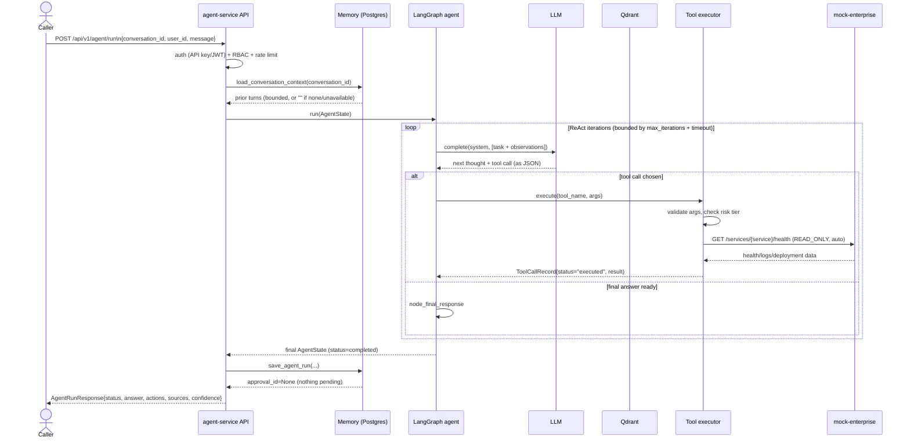
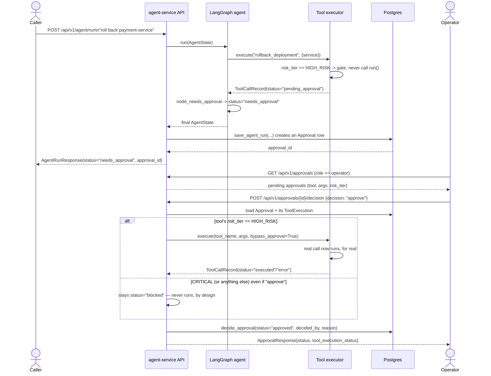
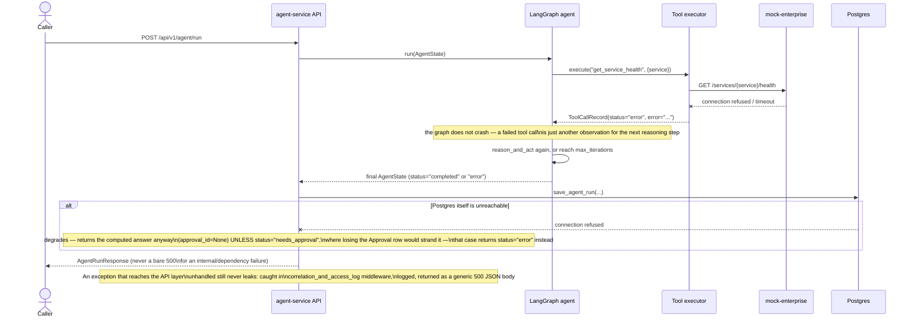

# Sequence diagrams

## 1. Incident investigation (happy path, no approval needed)

RAG search (`search_knowledge`) follows the same tool-executor path as
any other `READ_ONLY` tool — omitted above for space; see
`app/tools/knowledge.py`.

## 2. Human-in-the-loop approval (HIGH_RISK action)

The fail-safe this whole flow exists for: a `CRITICAL` tool's `run()` is
never called, from any code path, even an explicit "approve" decision —
enforced in `app/agent/executor.py::execute`, not just at the API layer.

## 3. Error handling — a downstream dependency fails mid-run

See `tests/test_memory.py`, `tests/test_rag.py`, and
`tests/test_observability.py` for these paths exercised for real (a
genuinely closed TCP port for the DB/Qdrant cases, not mocks).
